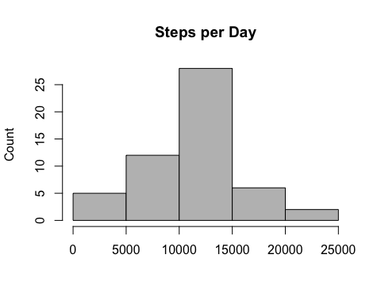
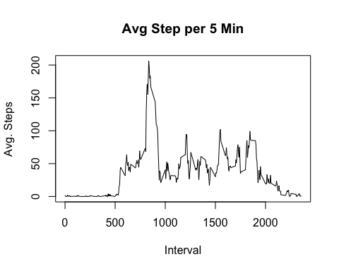
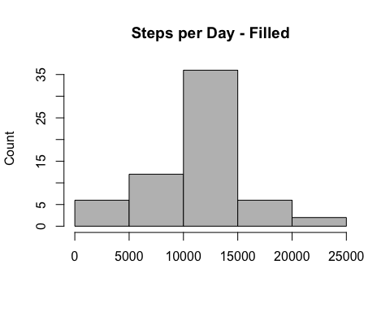
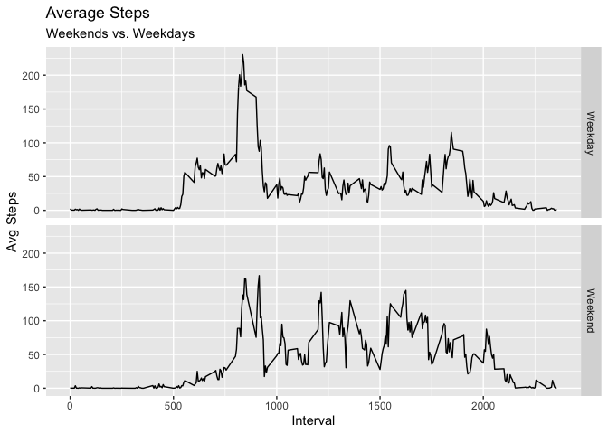

**Authored By: Pete Petersen**
               1-9-2019


The data for this assignment can be downloaded from the course web
site:

* Dataset: [Activity monitoring data](https://d396qusza40orc.cloudfront.net/repdata%2Fdata%2Factivity.zip) [52K]

The variables included in this dataset are:

* **steps**: Number of steps taking in a 5-minute interval (missing
    values are coded as `NA`)

* **date**: The date on which the measurement was taken in YYYY-MM-DD
    format

* **interval**: Identifier for the 5-minute interval in which
    measurement was taken


The dataset is stored in a comma-separated-value (CSV) file and there
are a total of 17,568 observations in this dataset.

### Loading and preprocessing the data

Show any code that is needed to

1. Load the data (i.e. `read.csv()`)

2. Process/transform the data (if necessary) into a format suitable for your analysis


```r
    library(readr)
    library(dplyr)
    library(knitr)
```


```r
    activity_raw <- read_csv("activity.csv")
```


```
##      steps             date               interval     
##  Min.   :  0.00   Min.   :2012-10-01   Min.   :   0.0  
##  1st Qu.:  0.00   1st Qu.:2012-10-16   1st Qu.: 588.8  
##  Median :  0.00   Median :2012-10-31   Median :1177.5  
##  Mean   : 37.38   Mean   :2012-10-31   Mean   :1177.5  
##  3rd Qu.: 12.00   3rd Qu.:2012-11-15   3rd Qu.:1766.2  
##  Max.   :806.00   Max.   :2012-11-30   Max.   :2355.0  
##  NA's   :2304
```


Table: Sample Raw Data

 steps       date       interval 
-------  ------------  ----------
  NA      2012-10-01       0     
  NA      2012-10-01       5     
  NA      2012-10-01       10    

### What is mean total number of steps taken per day?

For this part of the assignment, you can ignore the missing values in
the dataset.

1. Make a histogram of the total number of steps taken each day


```r
        activitysummary <-
              activity_raw[is.na(activity_raw$steps) == FALSE, ]  %>%
              group_by(date) %>%
              summarize(totalstep = sum(steps, na.rm = TRUE), )

              hist(activitysummary$totalstep, 
                    xlab="", main = "Steps per Day",
                    ylab="Count",col=8
                   )
```


2. Calculate and report the **mean** and **median** total number of steps taken per day


```r
meansteps <- mean(activitysummary$totalstep)
mediansteps <- median(activitysummary$totalstep)
```

**The mean steps per day were:** 


```
## [1] 10766.19
```

**The median steps per day were:** 


```
## [1] 10765
```
### What is the average daily activity pattern?

1. Make a time series plot (i.e. `type = "l"`) of the 5-minute interval (x-axis) and the average number of steps taken, averaged across all days (y-axis)

```r
                intervalaverage <-activity_raw[is.na(activity_raw$steps) == FALSE, ]  %>%
    group_by(interval) %>%
    summarize(avgsteps=mean(steps))

# Make an average activity plot
plot(intervalaverage$interval, intervalaverage$avgsteps, 
     type="l", main="Avg Step per 5 Min",
     xlab="Interval", ylab="Avg. Steps"
     )
```


2. Which 5-minute interval, on average across all the days in the dataset, contains the maximum number of steps?


```r
    maxstepintervalnum <- intervalaverage$interval[which.max(intervalaverage$avgsteps)]
```
**The interval number with the maximum average steps was:** 

```
## [1] 835
```

# Imputing missing values
Note that there are a number of days/intervals where there are missing
values (coded as `NA`). The presence of missing days may introduce
bias into some calculations or summaries of the data.

1. Calculate and report the total number of missing values in the dataset (i.e. the total number of rows with `NA`s)


```r
countna <- nrow(activity_raw[is.na(activity_raw$steps) == TRUE, ] ) 
```


```
## [1] 2304
```

2. Devise a strategy for filling in all of the missing values in the dataset. The strategy does not need to be sophisticated. For example, you could use the mean/median for that day, or the mean for that 5-minute interval, etc.


```r
activityfilled  <- activity_raw %>% 
  group_by(interval) %>% 
  mutate(steps = ifelse(is.na(steps), ceiling(mean(steps, na.rm = TRUE)), steps))
```

3. Create a new dataset that is equal to the original dataset but with the missing data filled in.


```
##      steps             date               interval     
##  Min.   :  0.00   Min.   :2012-10-01   Min.   :   0.0  
##  1st Qu.:  0.00   1st Qu.:2012-10-16   1st Qu.: 588.8  
##  Median :  0.00   Median :2012-10-31   Median :1177.5  
##  Mean   : 37.45   Mean   :2012-10-31   Mean   :1177.5  
##  3rd Qu.: 27.00   3rd Qu.:2012-11-15   3rd Qu.:1766.2  
##  Max.   :806.00   Max.   :2012-11-30   Max.   :2355.0
```


Table: Sample Filled Data

 steps       date       interval 
-------  ------------  ----------
   2      2012-10-01       0     
   1      2012-10-01       5     
   1      2012-10-01       10    

4. Make a histogram of the total number of steps taken each day and Calculate and report the **mean** and **median** total number of steps taken per day. Do these values differ from the estimates from the first part of the assignment? What is the impact of imputing missing data on the estimates of the total daily number of steps?

```r
        activitysummaryfilled <-
              activityfilled[is.na(activityfilled) == FALSE, ]  %>%
              group_by(date) %>%
              summarize(totalstep = sum(steps, na.rm = TRUE), )
```

```
## Warning: Length of logical index must be 1 or 17568, not 52704
```

```r
              hist(activitysummaryfilled$totalstep, 
                    xlab="", main = "Steps per Day - Filled",
                    ylab="Count",col=8
                   )
```




```r
meansteps <- mean(activitysummaryfilled$totalstep)
mediansteps <- median(activitysummaryfilled$totalstep)
```

**The mean steps per day with filled data were:** 


```
## [1] 10610.97
```

**The median steps per day with filled data were:** 


```
## [1] 10909
```
# Are there differences in activity patterns between weekdays and weekends?
### Are there differences in activity patterns between weekdays and weekends?

For this part the `weekdays()` function may be of some help here. Use
the dataset with the filled-in missing values for this part.

1. Create a new factor variable in the dataset with two levels -- "weekday" and "weekend" indicating whether a given date is a weekday or weekend day.

```r
    weekend <- c('Saturday','Sunday')
    activityfilled$isweekday <-as.factor(
              ifelse(weekdays(activityfilled$date) %in% weekend, 'Weekend','Weekday')
              )
    summary(activityfilled)
```

```
##      steps             date               interval        isweekday    
##  Min.   :  0.00   Min.   :2012-10-01   Min.   :   0.0   Weekday:12960  
##  1st Qu.:  0.00   1st Qu.:2012-10-16   1st Qu.: 588.8   Weekend: 4608  
##  Median :  0.00   Median :2012-10-31   Median :1177.5                  
##  Mean   : 37.45   Mean   :2012-10-31   Mean   :1177.5                  
##  3rd Qu.: 27.00   3rd Qu.:2012-11-15   3rd Qu.:1766.2                  
##  Max.   :806.00   Max.   :2012-11-30   Max.   :2355.0
```

1. Make a panel plot containing a time series plot (i.e. `type = "l"`) of the 5-minute interval (x-axis) and the average number of steps taken, averaged across all weekday days or weekend days (y-axis). The plot should look something like the following, which was created using **simulated data**:


```r
library(ggplot2)
```


```
## Warning: Ignoring unknown parameters: type
```

<!-- -->

